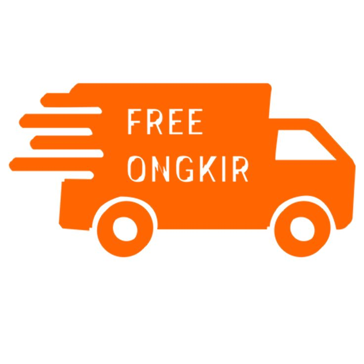

# UASPPW1_22-505523-SV-21815_Ecommerce_Makanan
Zefanya Diego Forlandicco
22/505523/SV/21815

Penjelasan website secara umum
Website yang saya buat berfungsi untuk memudahkan pelanggan untuk membeli makanan serta memesan sebuah tempat yang masih berada dalam restaurant tersebut.
Karena klien memnutuhkan aplikasi untuk pemesanan makanan maka saya mendesain website yang dapat di ubah di segala 
device sehingga konsumen akan mudah untuk mengakses website tersebut.
Website ini diharap untuk mengakomodasi beberapa restaurant tetapi masih satu manajemen sehingga memudahkan konsumen untuk membeli bermacam makanan dan minuman
di dalam satu website.

Bagaimana website yang dibuat menjawab 4 requirement dasar (kriteria penilaian).
1. Desain rapi mengikuti kaidah atau prinsip desain,
  Website yang saya buat sudah sesuai kaidah desain karena sudah memiliki desain yang konsisten dan bagus. 
  Seperti sidebar saya memberikan gambar makanan berbeda beda dan saya atur bordernya.
  
2. Website responsive, dapat diakses melalui device: Mobile, Tablet dan Laptop,
  Website yang saya buat sudah dapat  diakses melalui device: Mobile, Tablet dan Laptop, karena saya membuat 4 responsive yang berukuran berbeda agar dapat dijalankan pada semjua device.
3. Direct feedback ke pengguna website,
  Webisite saya sudah memiliki feedback ke pengguna website. Saat awal masuk akan muncul otomatis  popup log-in apabila pengguna tidak mau
  log-in ke website pengguna dapat mengeklik tombol X pada pojok kanan atas di layar popup
  
4. Konten dinamis dari database.
  Konten saya sudah dinamis karena memiliki Link Reservasi yang yang apabila kita mengeklik tombol reservasi dan mengisi data maka data
  yang kita isi dalam form akan terisi ke database.

Contoh kode untuk Kriteria Penilaian:
1. Desain rapi mengikuti kaidah atau prinsip desain,
Contoh Kode 
Css
.header-top,
.header-user-actions,
.desktop-navigation-menu { display: none; }
.header-main {
  padding: 20px 0;
  border-bottom: 1px solid var(--cultured);
}
.header-logo { margin-bottom: 20px; }
.header-logo img { margin: auto; }
.header-search-container { position: relative; }
.header-search-container .search-field {
  font-size: var(--fs-7);
  color: var(--onyx);
  padding: 10px 15px;
  padding-right: 50px;
  border: 1px solid var(--cultured);
  -webkit-border-radius: var(--border-radius-md);
          border-radius: var(--border-radius-md);
}
PENJELASAN CSS KRITERIA 1
Kode JavaScript di atas berfungsi untuk mengontrol perilaku modal atau jendela pop-up pada halaman web. Berikut adalah penjelasan untuk setiap bagian kode:

`const modalCloseFunc = function () {modal.classList.add('closed')}`
   - Ini adalah deklarasi sebuah fungsi yang disimpan dalam variabel `modalCloseFunc`. Fungsi ini digunakan untuk menambahkan kelas `'closed'` ke elemen dengan kelas `modal`. Tujuan dari fungsi ini adalah untuk menyembunyikan modal dengan menambahkan kelas `'closed'` pada elemen tersebut.
modalCLoseOverlay.addEventListener('click', modalCloseFunc);`
   - Ini adalah event listener (pendengar acara) yang ditetapkan pada elemen dengan kelas `modalCLoseOverlay`. Event listener ini akan merespons klik pada elemen tersebut dengan menjalankan fungsi `modalCloseFunc`. Dengan demikian, saat pengguna mengklik overlay pada modal, modal akan ditutup.
`modalCloseBtn.addEventListener('click', modalCloseFunc);`
   - Ini adalah event listener (pendengar acara) yang ditetapkan pada elemen dengan kelas `modalCloseBtn`. Event listener ini akan merespons klik pada elemen tersebut dengan menjalankan fungsi `modalCloseFunc`. Dengan demikian, saat pengguna mengklik tombol tutup pada modal, modal akan ditutup.
Dalam kedua event listener di atas, saat fungsi `modalCloseFunc` dijalankan, kelas `'closed'` akan ditambahkan ke elemen dengan kelas `modal`. Tambahan kelas ini kemudian dapat digunakan dalam CSS untuk menyembunyikan atau mengubah tampilan modal sesuai kebutuhan.

2. Website responsive, dapat diakses melalui device: Mobile, Tablet dan Laptop.
Penjelasan Untuk Contoh Kode di bawah :
Kode Css  di bawah membuat web saya menjadi responsive sehingga dapat diakses ke berbagai device. Kode di bawah adalah sebuah CSS yang mengatur tata letak responsif dari suatu halaman web. Kode ini menggunakan aturan media query `@media` untuk menentukan perubahan tampilan pada berbagai ukuran layar.
Berikut adalah penjelasan rinci dari setiap bagian kode tersebut:
@media (min-width: 480px) { ... }
Bagian ini adalah media query untuk layar dengan lebar minimum 480 piksel. Semua perubahan gaya yang terdapat di dalam blok ini akan diterapkan hanya jika lebar layar mencapai atau melebihi 480 piksel.
:root { ... }
Ini adalah selector untuk elemen root atau root element, yaitu elemen tertinggi dalam dokumen HTML (biasanya elemen `<html>`). Di dalamnya terdapat beberapa properti yang ditetapkan dengan menggunakan custom property atau variabel CSS.
.header-top { ... }
Ini adalah selector untuk elemen dengan kelas "header-top". Beberapa gaya yang diterapkan di sini termasuk tampilan, padding, dan garis bawah.
@media (min-width: 570px) { ... }
Ini adalah media query kedua yang menargetkan layar dengan lebar minimum 570 piksel. Setiap perubahan gaya di dalam blok ini akan diterapkan hanya jika lebar layar mencapai atau melebihi 570 piksel
@media (min-width: 768px) { ... }
Ini adalah media query ketiga yang menargetkan layar dengan lebar minimum 768 piksel. Setiap perubahan gaya di dalam blok ini akan diterapkan hanya jika lebar layar mencapai atau melebihi 768 piksel.
Penjelasan rinci dari setiap bagian di dalam blok gaya tersebut dapat ditemukan dalam komentar yang disertakan di samping setiap selector. Misalnya, "#CUSTOM PROPERTY", "#HEADER", "#BANNER", "#PRODUCT", "#CTA", dan "#FOOTER" menandakan bagian-bagian yang dipengaruhi oleh gaya yang diterapkan di bawahnya.
Secara keseluruhan, kode tersebut mengatur tata letak dan gaya elemen-elemen di halaman web agar responsif terhadap ukuran layar yang berbeda.

Contoh Salah satu Kode css Responsive :
@media (min-width: 480px) {
  /**
   * #CUSTOM PROPERTY
   */
  :root {
    /**
     * typography 
     */
    --fs-1: 1.875rem;
  }
  /**
   * #HEADER
   */
  .header-top {
    display: block;
    padding: 10px 0;
    border-bottom: 1px solid var(--cultured);
  }

  .header-social-container,
  .header-top-actions { display: none; }

  .header-alert-news {
    color: var(--sonic-silver);
    font-size: var(--fs-9);
    text-transform: uppercase;
  }

  .header-alert-news b { font-weight: var(--weight-500); }

  .header-main { padding: 25px 0; }

  .mobile-bottom-navigation {
    -webkit-border-top-left-radius: var(--border-radius-md);
            border-top-left-radius: var(--border-radius-md);
    -webkit-border-top-right-radius: var(--border-radius-md);
            border-top-right-radius: var(--border-radius-md);
  }

  /**
   * #BANNER
   */

  .slider-item { aspect-ratio: 5 / 3; }

  .banner-content {
    top: 50%;
    right: auto;
    bottom: auto;
    -webkit-transform: translateY(-50%);
        -ms-transform: translateY(-50%);
            transform: translateY(-50%);
    max-width: 320px;
  }

  .banner-subtitle { --fs-7: 1rem; }

  .banner-text {
    display: block;
    color: var(--sonic-silver);
    font-size: var(--fs-7);
    font-weight: var(--weight-500);
    margin-bottom: 10px;
  }

  .banner-text b { font-size: var(--fs-2); }

  .banner-btn { padding: 7px 20px; }
  /**
   * #PRODUCT 
   */

  .product-grid {
    -ms-grid-columns: 1fr 30px 1fr;
    grid-template-columns: 1fr 1fr;
    gap: 30px;
  }
  /**
   * #CTA
   */

  .cta-content { padding: 40px; }

  .cta-content .discount {
    --fs-11: 0.875rem;
    padding: 5px 10px;
  }

  .cta-title { --fs-5: 1.5rem; }

  .cta-text { --fs-7: 1rem; }

  .cta-btn { --fs-9: 1rem; }
  /**
   * #FOOTER
   */

  .copyright { --fs-8: 0.875rem; }
}

Kami Memiliki 4 Besaran yang berbeda yaitu :

@media (min-width: 480px) {

@media (min-width: 570px) {
@media (min-width: 768px) {

@media (min-width: 1024px) {

3. Direct feedback ke pengguna website.
HTML
    

    

      <button class="modal-close-btn" data-modal-close>
        <ion-icon name="close-outline"></ion-icon>
      </button>

      

        
      

      

        <form action="#">
          

            <h3 class="newsletter-title">Log-In</h3>
            

              Masuk ke <b>Arca.co</b> untuk mendapatkan gratis ongkir
            

          

          <input type="email" name="email" class="email-field" placeholder="Email Address" required>
          <button type="submit" class="btn-newsletter">Log-In</button>

        </form>
      

    

  

HTML KRITERIA 3
Kode yang diatas adalah contoh kode HTML dan CSS untuk membuat sebuah halaman web responsif. Kode tersebut memiliki beberapa komponen seperti header, banner, produk, CTA (Call to Action), dan footer.
Kode CSS tersebut menggunakan media query (`@media`) untuk mengatur tampilan halaman web pada berbagai ukuran layar. Ada beberapa media query yang ditentukan dengan lebar minimum tertentu, seperti 480 piksel, 570 piksel, 768 piksel, dan 1024 piksel. Setiap media query menargetkan layar dengan lebar yang sesuai dan mengubah tata letak dan gaya elemen-elemen dalam halaman.
Misalnya, pada media query dengan lebar minimum 480 piksel, beberapa perubahan gaya yang diterapkan antara lain mengatur tampilan header, banner, produk, CTA, dan footer. Properti seperti padding, ukuran font, tampilan blok, dan lainnya diubah sesuai dengan ukuran layar yang lebih besar.
Kode HTML di atas adalah contoh struktur markup untuk sebuah modal atau jendela pop-up yang mungkin digunakan dalam halaman web. Modal ini memiliki elemen-elemen seperti overlay, konten modal, tombol tutup, gambar, dan formulir untuk log masuk. Anda juga dapat melihat penggunaan atribut data untuk mengontrol perilaku modal.
Perlu dicatat bahwa kode yang Anda berikan hanya contoh dan tergantung pada kebutuhan dan desain halaman web Anda, Anda dapat mengubah dan menyesuaikannya sesuai dengan kebutuhan Anda.

Kode CSS  KRITERIA 3
.modal {
  position: fixed;
  top: 0;
  left: 0;
  width: 100%;
  height: 100vh;
  background: hsla(0, 0%, 0%, 0.5);
  display: -webkit-box;
  display: -webkit-flex;
  display: -ms-flexbox;
  display: flex;
  -webkit-box-pack: center;
  -webkit-justify-content: center;
      -ms-flex-pack: center;
          justify-content: center;
  -webkit-box-align: center;
  -webkit-align-items: center;
      -ms-flex-align: center;
          align-items: center;
  opacity: 0;
  visibility: hidden;
  pointer-events: none;
  z-index: 10;
  -webkit-animation: popup 1s ease-in-out 5s forwards;
          animation: popup 1s ease-in-out 5s forwards;
}

@-webkit-keyframes popup {

  0% {
    opacity: 0;
    visibility: hidden;
    pointer-events: none;
  }

  100% {
    opacity: 1;
    visibility: visible;
    pointer-events: all;
  }

}

@keyframes popup {

  0% {
    opacity: 0;
    visibility: hidden;
    pointer-events: none;
  }

  100% {
    opacity: 1;
    visibility: visible;
    pointer-events: all;
  }

}

.modal.closed { display: none; }

.modal-close-overlay {
  position: absolute;
  top: 0;
  left: 0;
  width: 100%;
  height: 100%;
  z-index: 1;
}

.newsletter-img { display: none; }

.modal-content {
  position: relative;
  max-width: 350px;
  margin: 20px;
  background: var(--white);
  -webkit-border-radius: var(--border-radius-md);
          border-radius: var(--border-radius-md);
  overflow: hidden;
  z-index: 2;
  -webkit-animation: scaleUp 0.5s ease-in-out 5s forwards;
          animation: scaleUp 0.5s ease-in-out 5s forwards;
}

@-webkit-keyframes scaleUp {

  0% { -webkit-transform: scale(0.9); transform: scale(0.9); }
  100% { -webkit-transform: scale(1); transform: scale(1); }

}

@keyframes scaleUp {

  0% { -webkit-transform: scale(0.9); transform: scale(0.9); }
  100% { -webkit-transform: scale(1); transform: scale(1); }

}

.modal-close-btn {
  position: absolute;
  top: 15px;
  right: 15px;
  background: var(--salmon-pink);
  color: var(--white);
  font-size: 16px;
  padding: 5px;
  -webkit-border-radius: var(--border-radius-sm);
          border-radius: var(--border-radius-sm);
}

.modal-close-btn:hover { opacity: 0.9; }

.modal-close-btn ion-icon { --ionicon-stroke-width: 70px; }

.newsletter {
  padding: 50px 30px;
  text-align: center;
}

.newsletter-header { margin-bottom: 20px; }

.newsletter-title {
  color: var(--onyx);
  font-size: var(--fs-2);
  font-weight: var(--weight-600);
  margin-bottom: 10px;
}

.newsletter-desc {
  color: var(--sonic-silver);
  font-size: var(--fs-7);
  line-height: 1.6;
}

.email-field {
  font-size: var(--fs-7);
  padding: 8px 16px;
  -webkit-border-radius: var(--border-radius-sm);
          border-radius: var(--border-radius-sm);
  border: 1px solid var(--cultured);
  margin-bottom: 16px;
}
.btn-newsletter {
  background: var(--eerie-black);
  color: var(--white);
  font-size: var(--fs-7);
  font-weight: var(--weight-600);
  text-transform: uppercase;
  padding: 10px 15px;
  -webkit-border-radius: var(--border-radius-sm);
          border-radius: var(--border-radius-sm);
  margin: auto;
  -webkit-transition: var(--transition-timing);
  -o-transition: var(--transition-timing);
  transition: var(--transition-timing);
}
.btn-newsletter:hover { background: var(--salmon-pink); }
Penjelasan CSS
Kode di atas adalah kode CSS yang mengatur tampilan dan perilaku dari elemen-elemen dalam modal atau jendela pop-up. Berikut adalah penjelasan untuk setiap bagian dalam kode tersebut:
. `.modal`: Ini adalah selector untuk elemen modal. Beberapa properti CSS yang diatur di sini termasuk posisi (`position: fixed`), lebar dan tinggi (`width: 100%; height: 100vh`), latar belakang (`background`), tata letak (`display` dan `justify-content`), transparansi (`opacity`), dan visibilitas (`visibility`). Selain itu, animasi juga diterapkan menggunakan keyframes (`@keyframes`) dengan nama "popup".
. `.modal.closed`: Ini adalah selector untuk elemen modal dengan kelas "closed". Properti `display: none` diterapkan untuk menyembunyikan elemen modal yang memiliki kelas ini.
. `.modal-close-overlay`: Ini adalah selector untuk elemen overlay di atas modal. Properti yang diatur termasuk posisi (`position: absolute`), lebar dan tinggi (`width: 100%; height: 100%`), dan z-index.
. `.newsletter-img`: Ini adalah selector untuk elemen gambar dalam modal. Properti `display: none` diterapkan untuk menyembunyikan elemen ini.
. `.modal-content`: Ini adalah selector untuk elemen konten dalam modal. Beberapa properti yang diatur di sini termasuk posisi (`position: relative`), lebar maksimum (`max-width`), margin, latar belakang, sudut melengkung pada border (`border-radius`), overflow, dan animasi menggunakan keyframes dengan nama "scaleUp".
. `.modal-close-btn`: Ini adalah selector untuk tombol penutup dalam modal. Properti yang diatur termasuk posisi (`position: absolute`), posisi top dan right, latar belakang, warna teks, ukuran font, padding, sudut melengkung pada border, dan perilaku saat digunakan (`:hover`).
. `.newsletter`: Ini adalah selector untuk elemen bagian newsletter dalam modal. Beberapa properti yang diatur termasuk padding, tata letak teks, dan margin.
. `.newsletter-header`: Ini adalah selector untuk elemen judul dalam bagian newsletter. Properti yang diatur di sini termasuk margin bawah.
. `.newsletter-title`: Ini adalah selector untuk elemen judul utama dalam bagian newsletter. Beberapa properti yang diatur termasuk warna teks, ukuran font, ketebalan font, dan margin bawah.
. `.newsletter-desc`: Ini adalah selector untuk elemen deskripsi dalam bagian newsletter. Beberapa properti yang diatur termasuk warna teks, ukuran font, ketinggian baris, dan margin bawah.
. `.email-field`: Ini adalah selector untuk elemen input email dalam bagian newsletter. Beberapa properti yang diatur termasuk ukuran font, padding, sudut melengkung pada border, dan margin bawah.
. `.btn-newsletter`: Ini adalah selector untuk tombol dalam bagian newsletter. Beberapa properti yang diatur termasuk latar belakang, warna teks, ukuran font, ketebalan font, transformasi teks, padding, sudut melengkung pada border, posisi tengah, dan transisi saat digunakan (`:hover`).

CONTOH JS KRITERIA 3
/ Modal Function
const modalCloseFunc = function () {modal.classList.add('closed')}
// Modal EventListener
modalCLoseOverlay.addEventListener('click', modalCloseFunc);
modalCloseBtn.addEventListener('click', modalCloseFunc);

PENJELASAN KODE JS KRITERIA 3
Kode JavaScript kode diatas adalah berfungsi untuk mengontrol perilaku modal atau jendela pop-up pada halaman web. Berikut adalah penjelasan untuk setiap bagian kode:
const modalCloseFunc = function () {modal.classList.add('closed')}`
   - Ini adalah deklarasi sebuah fungsi yang disimpan dalam variabel `modalCloseFunc`. Fungsi ini digunakan untuk menambahkan kelas `'closed'` ke elemen dengan kelas `modal`. Tujuan dari fungsi ini adalah untuk menyembunyikan modal dengan menambahkan kelas `'closed'` pada elemen tersebut.
`modalCLoseOverlay.addEventListener('click', modalCloseFunc);`
   - Ini adalah event listener (pendengar acara) yang ditetapkan pada elemen dengan kelas `modalCLoseOverlay`. Event listener ini akan merespons klik pada elemen tersebut dengan menjalankan fungsi `modalCloseFunc`. Dengan demikian, saat pengguna mengklik overlay pada modal, modal akan ditutup.
`modalCloseBtn.addEventListener('click', modalCloseFunc);`
   - Ini adalah event listener (pendengar acara) yang ditetapkan pada elemen dengan kelas `modalCloseBtn`. Event listener ini akan merespons klik pada elemen tersebut dengan menjalankan fungsi `modalCloseFunc`. Dengan demikian, saat pengguna mengklik tombol tutup pada modal, modal akan ditutup.
Dalam kedua event listener di atas, saat fungsi `modalCloseFunc` dijalankan, kelas `'closed'` akan ditambahkan ke elemen dengan kelas `modal`. Tambahan kelas ini kemudian dapat digunakan dalam CSS untuk menyembunyikan atau mengubah tampilan modal sesuai kebutuhan.

4. Konten dinamis dari database.
Contoh Kode PHP

if ($_SERVER['REQUEST_METHOD'] === 'POST') {
  $id_meja = $_POST['id_meja'];
  $nomor_meja = $_POST['nomor_meja'];
  $status_meja = $_POST['status_meja'];

  $query = "INSERT INTO meja (id_meja, 
Kode di atas merupakan potongan dari kode PHP yang digunakan untuk memproses data yang dikirim melalui metode POST dari suatu form. Mari kita jelaskan setiap bagian dari kode tersebut:
. `if ($_SERVER['REQUEST_METHOD'] === 'POST') { ... }`
   - Kode ini mengawali blok kondisional, yang mengecek apakah metode permintaan (request method) yang digunakan adalah POST. Jika kondisi ini benar, maka blok kode di dalamnya akan dieksekusi. Hal ini berarti bahwa blok kode ini akan berjalan ketika form di-submit dengan metode POST.
. `$id_meja = $_POST['id_meja'];`
   - Baris ini mengambil nilai yang dikirim melalui input dengan atribut `name` bernama "id_meja" pada form yang di-submit. Nilai ini kemudian disimpan ke dalam variabel `$id_meja` untuk digunakan dalam query database nanti.
. `$nomor_meja = $_POST['nomor_meja'];`
   - Baris ini mengambil nilai yang dikirim melalui input dengan atribut `name` bernama "nomor_meja" pada form yang di-submit. Nilai ini kemudian disimpan ke dalam variabel `$nomor_meja` untuk digunakan dalam query database nanti.
. `$status_meja = $_POST['status_meja'];`
   - Baris ini mengambil nilai yang dikirim melalui input dengan atribut `name` bernama "status_meja" pada form yang di-submit. Nilai ini kemudian disimpan ke dalam variabel `$status_meja` untuk digunakan dalam query database nanti.
. `$query = "INSERT INTO meja (id_meja, ...`
   - Baris ini mendefinisikan variabel `$query` yang berisi perintah SQL untuk melakukan operasi INSERT ke dalam tabel "meja". Nilai-nilai yang diambil sebelumnya dari form akan digunakan sebagai nilai kolom dalam operasi INSERT.
. `if (mysqli_query($conn, $query)) { ... }`
   - Kode ini menjalankan query yang telah dibuat dengan menggunakan fungsi `mysqli_query()`. Jika query berhasil dijalankan, maka blok kode di dalamnya akan dieksekusi. Dalam contoh ini, pesan "Reservasi Berhasil" beserta detail informasi meja akan ditampilkan.
. `echo "Error: " . $query . " " . mysqli_error($conn);`
   - Jika query gagal dieksekusi, maka blok kode di dalam blok `else` akan dieksekusi. Kode ini akan menampilkan pesan error beserta detailnya untuk membantu dalam melakukan debugging.
. `mysqli_close($conn);`
   - Baris terakhir ini digunakan untuk menutup koneksi ke database setelah proses query selesai dilakukan.
Kode tersebut merupakan contoh sederhana untuk memproses data yang dikirim melalui form dan menyimpannya ke dalam database menggunakan bahasa pemrograman PHP dan MySQL.
